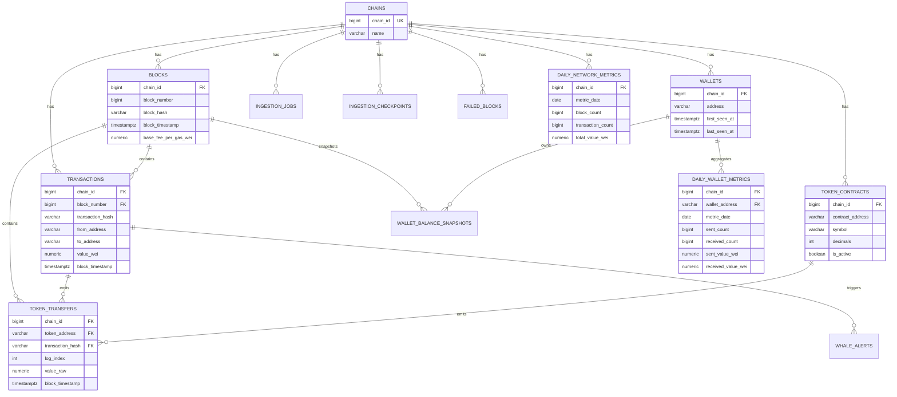

# ChainSight Database ERD

The warehouse schema is chain-scoped so the project can support Ethereum first and add other chains later without redesigning primary analytical tables.

## Key Constraints

| Table | Constraint | Purpose |
|---|---|---|
| `blocks` | `UNIQUE (chain_id, block_number)` | Prevent duplicate block ingestion |
| `blocks` | `UNIQUE (chain_id, block_hash)` | Preserve block identity |
| `transactions` | `UNIQUE (chain_id, transaction_hash)` | Make transaction ingestion idempotent |
| `token_contracts` | `UNIQUE (chain_id, contract_address)` | Track selected tokens per chain |
| `token_transfers` | `UNIQUE (chain_id, token_address, transaction_hash, log_index)` | Prevent duplicate ERC-20 logs |
| `ingestion_checkpoints` | `UNIQUE (chain_id)` | One checkpoint per chain |
| `failed_blocks` | `UNIQUE (chain_id, block_number)` | Durable retry state per failed block |

## Indexing Strategy

The initial indexes support the MVP query shapes:

- Wallet transaction history: `chain_id`, wallet address, timestamp.
- Token transfer activity: `chain_id`, token address, timestamp.
- Daily charts: chain-scoped dates and timestamps.
- Largest transfers: chain-scoped descending value indexes.
- Operational views: job status and failed-block status.

Benchmark evidence will be added later with `EXPLAIN ANALYZE` before and after index usage.
